# This is an iot app that allows you control devices such as light, motor, sound based on data from sensor
 

## Login
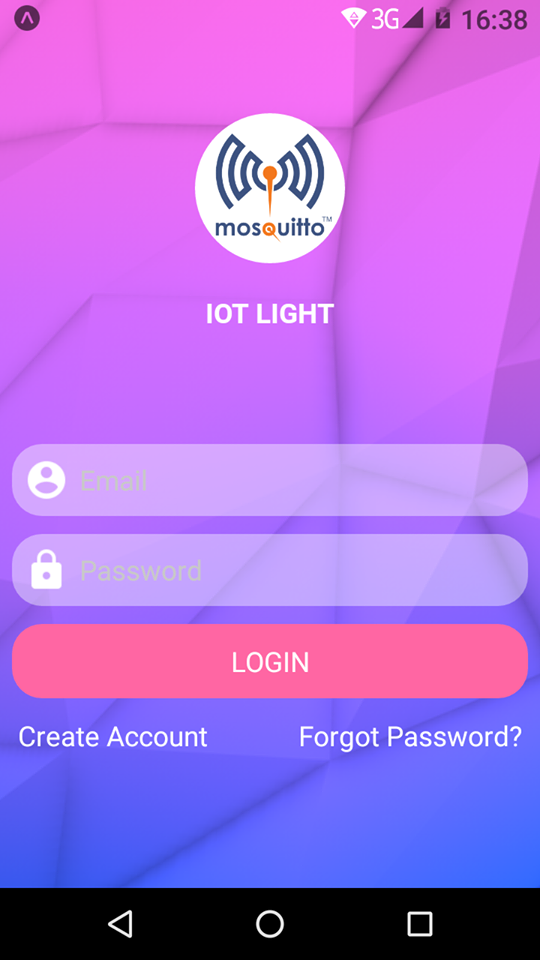
 
 

## Sign up
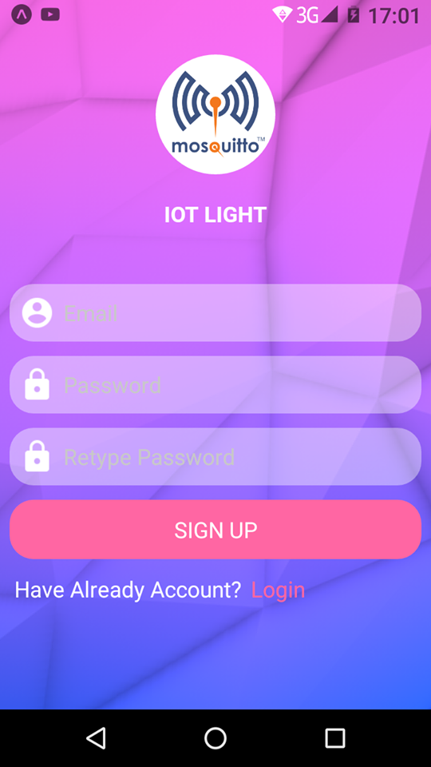
 
 

## Forgot password
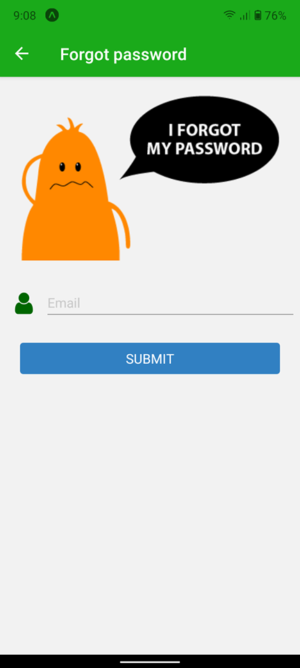
 
 

## Change name
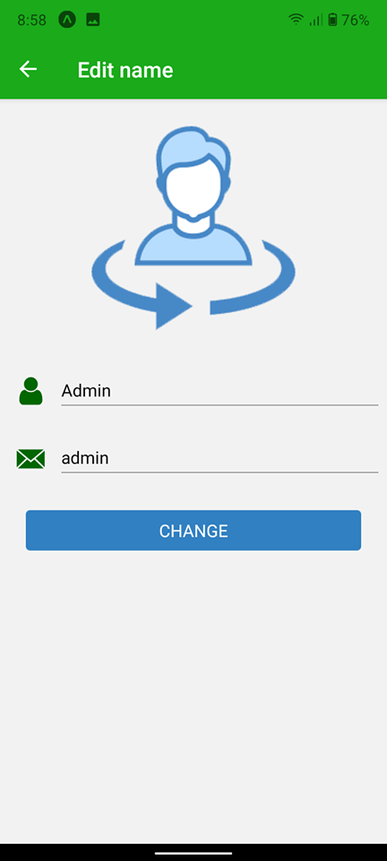
 
 

## Change password
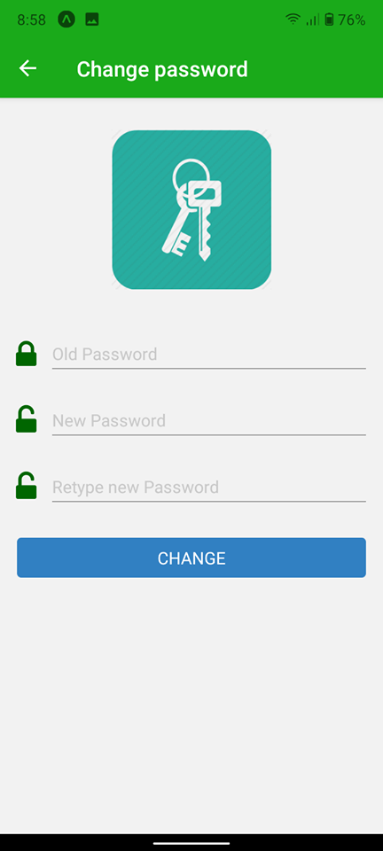
 
 

## Home
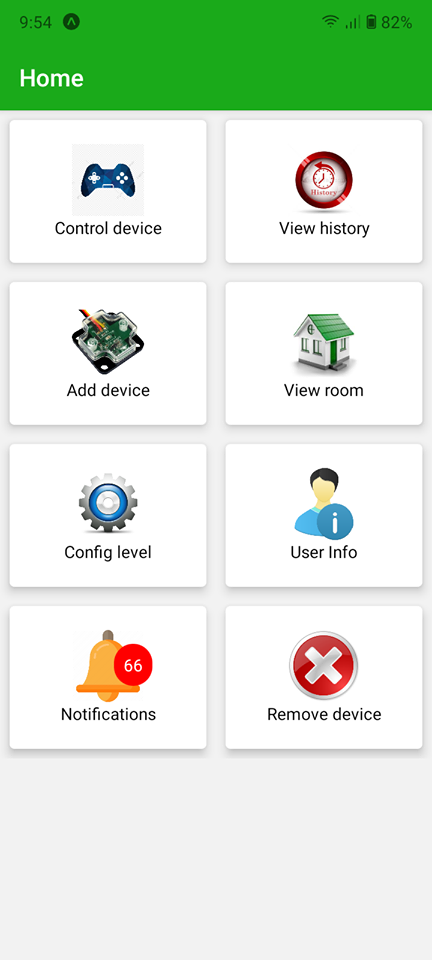
 
 

## List room is controlled by user, select room to control device
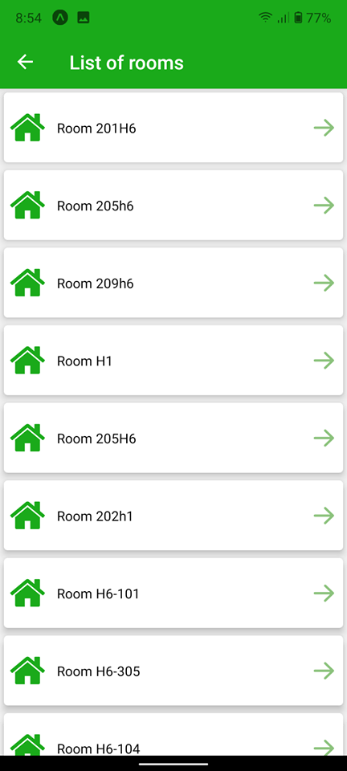
 
 

## List devices in room, select device to control it
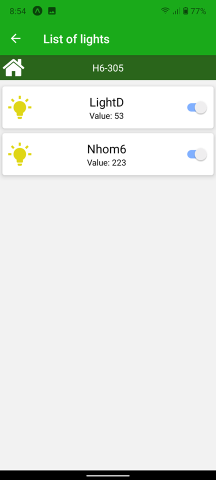
 
 

## History, save status and value of device
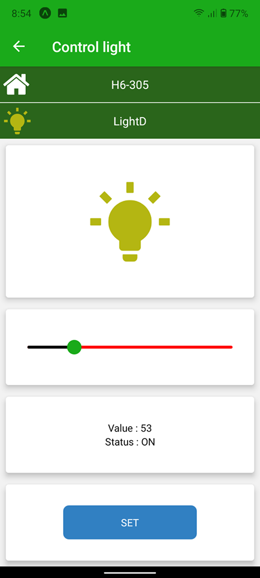
 
 

## Add new device, click type of device that you want to add
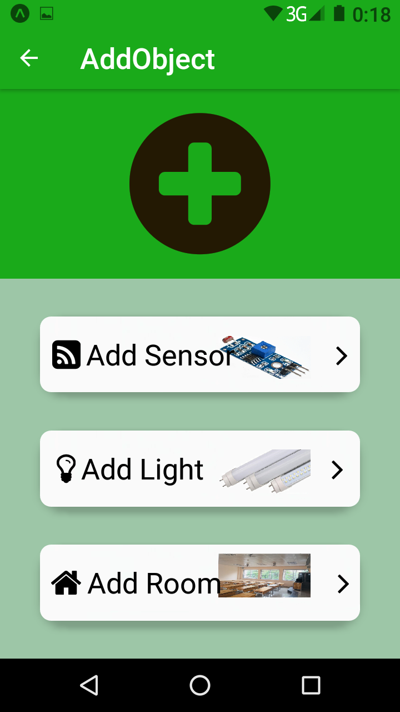
 
 

## Add new sensor
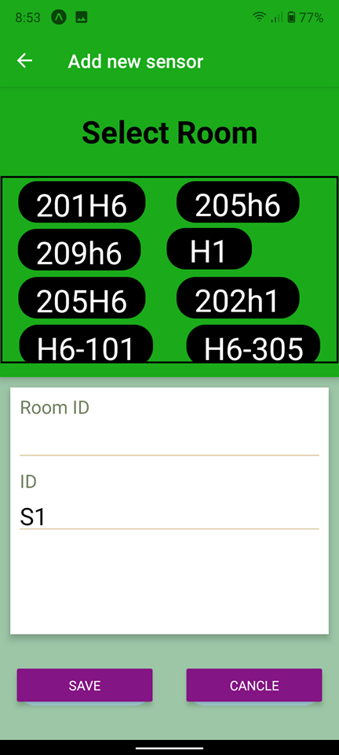
 
 

## Room information: display name, owner, and value of device in room.
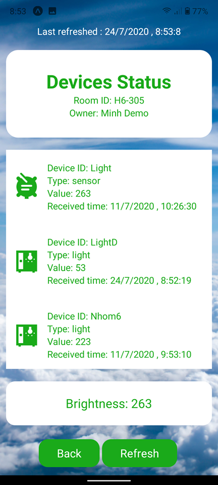
 
 

## User info
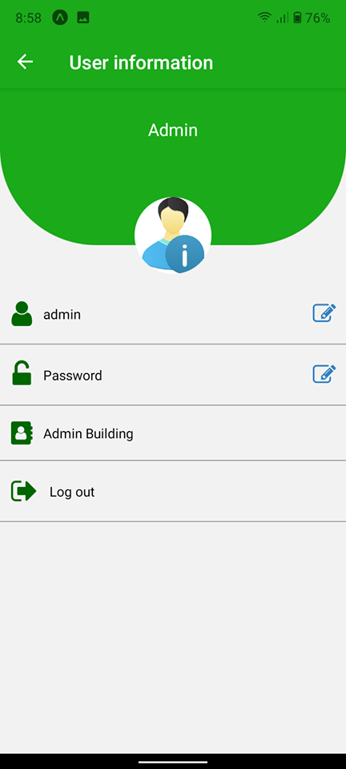
 
 

## Database (EERD)

 
 

## Database (EERD)
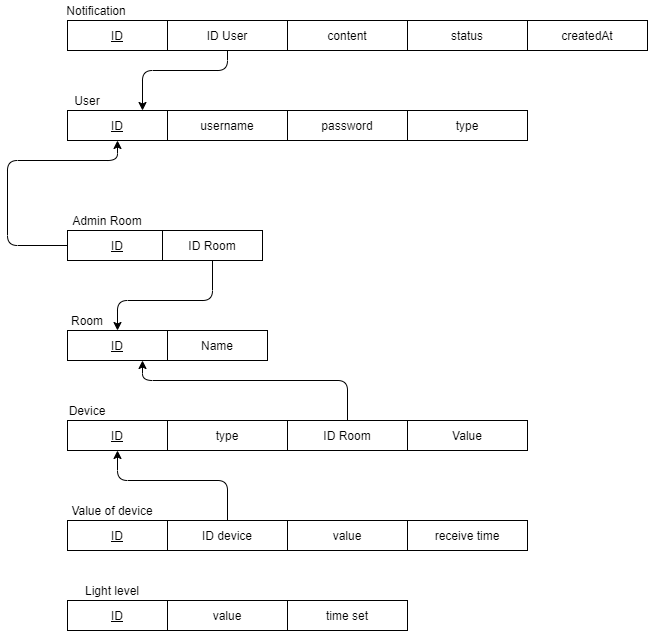

